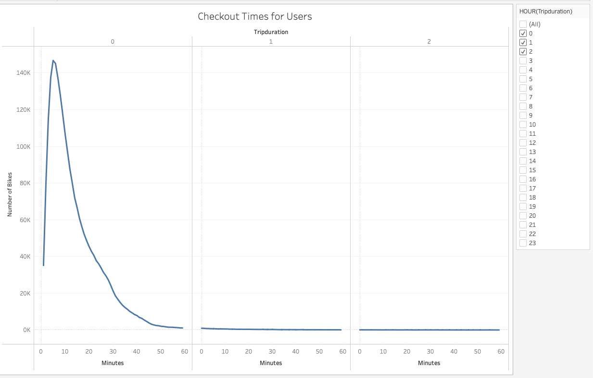
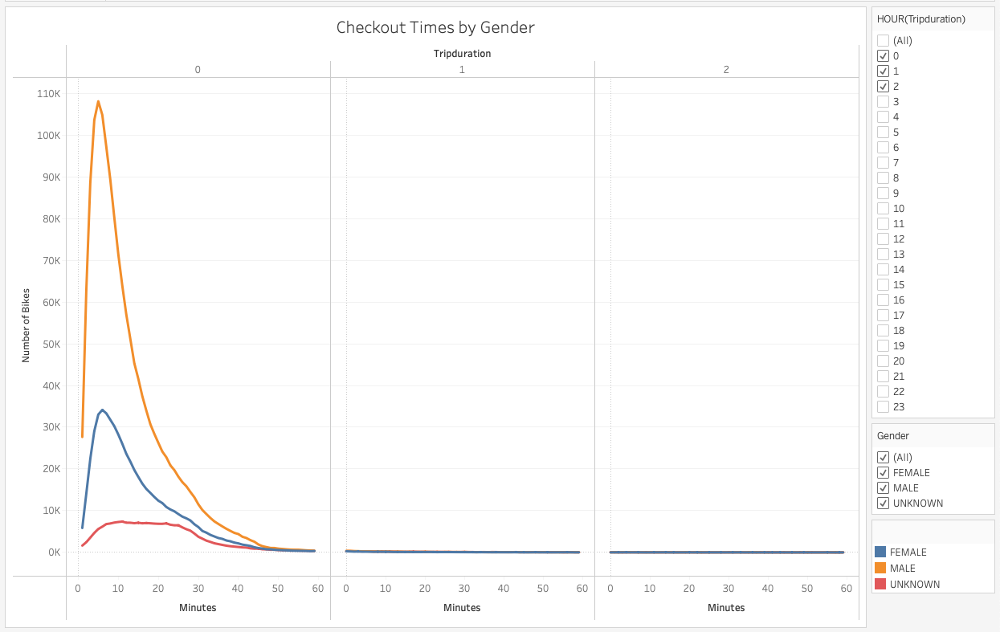
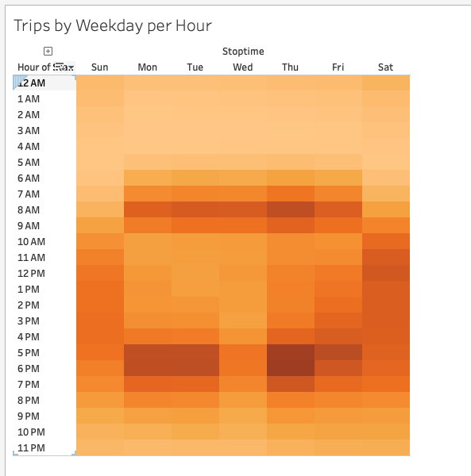
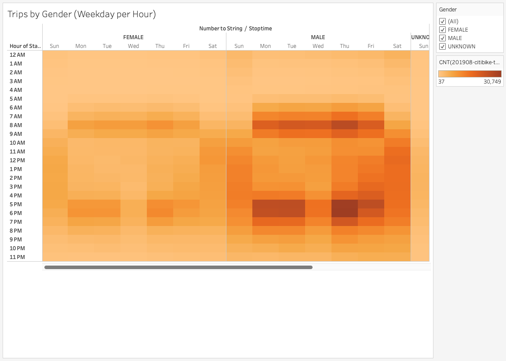
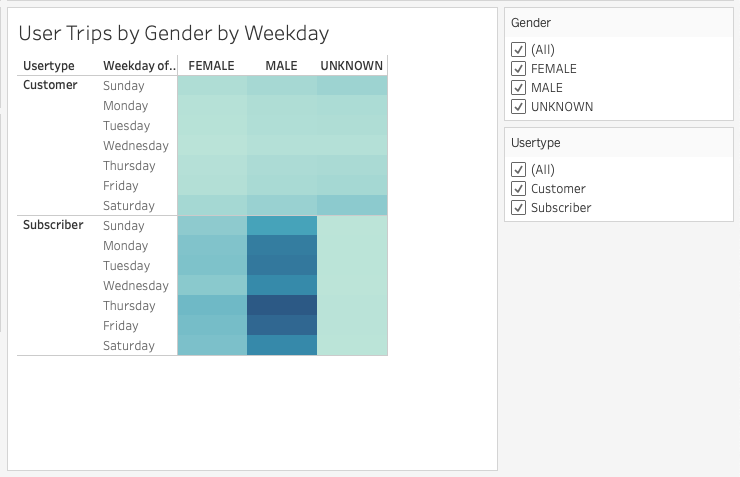
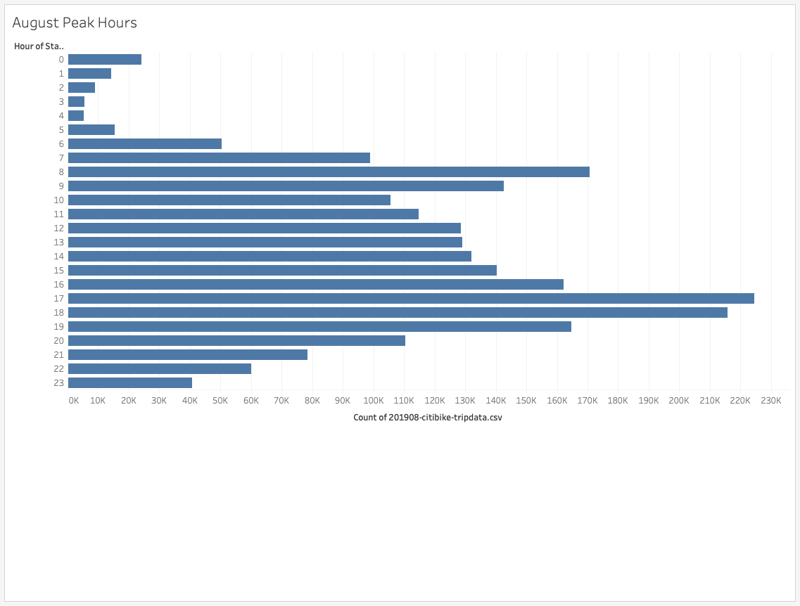
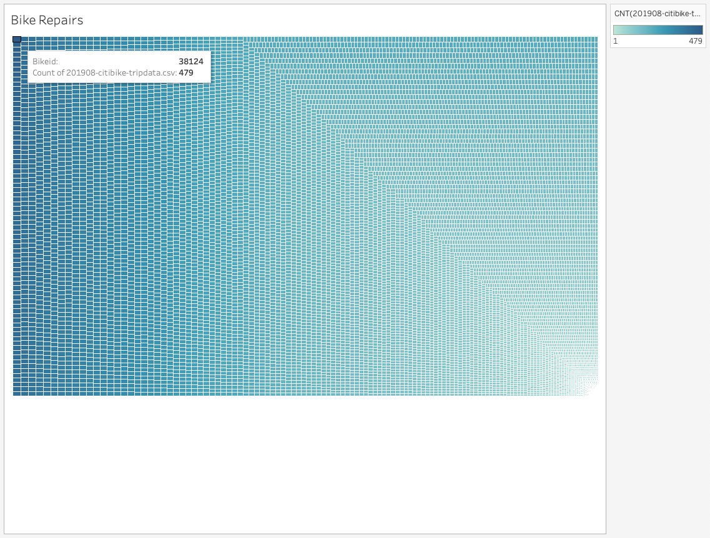
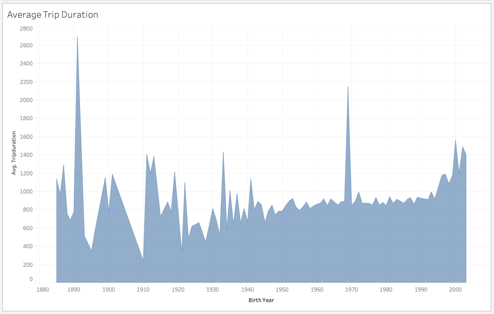
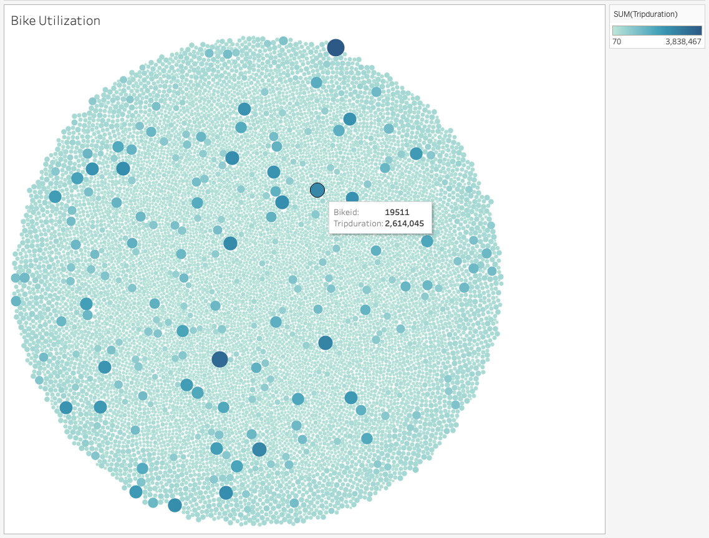

# Bike sharing
## Overview
[Link to Tableau Public Bike Sharing Storyboard](https://link)

There was a need to convince investors that a bike-sharing program in Des Moines is a solid business proposal. To solidify the proposal, one of the key stakeholders wanted to see a bike trip analysis of Citibike bike sharing data from New York City, to be used for a final presentation and analysis to pitch to investors.

For this analysis, Pandas was used to change the "tripduration" column from an integer to a datetime datatype. Then, using the converted datatype, a set of visualizations was created to:

- Show the length of time that bikes are checked out for all riders and genders
- Show the number of bike trips for all riders and genders for each hour of each day of the week
- Show the number of bike trips for each type of user and gender for each day of the week
- These new visualizations were then added to two additional ones that were previously created

## Results

### Visualization 1: Checkout Times for All Users

This visualization shows the length of time that bikes were checked out for all riders. The data tells us that the vast majority of bike users use the bikes for a duration of 30 minutes or less, with a peak at around 10 minutes. This tells us that most bikers will not travel long distances before completing their bike journeys.
 (see above)

### Visualization 2: Checkout Times by Gender

This visualization shows the length of time that bikes were checked out for each gender. This data tells us that males check out bikes at about three times the rate of females. There doesn't seem to be a big difference between males, females and unknowns in terms of the amount of times bikes are used, with the most bikes by far checked out for 30 minutes or less. (see above)

### Visualization 3: Trips by Weekday for Each Hour

This visualization shows the number of bike trips by weekday for each hour of the day, as a heatmap. As probably expected, due to working schedules, the most common time of day for bike usage is between 7-9 am and 4-7 pm on weekdays. One interesting anomaly appears to be on Wednesday evenings, where usage appears to be a little lighter than on other weekdays. On weekends, the usage is a bit more even and spread out, wwith the peak times of usage between 10 am and 5 pm. (see above)

### Visualization 4:  Trips by Gender (Weekday per Hour)

This visualization shows the number of bike trips by gender for each hour of each day of the week, as a heatmap. Similarly to all users, patterns appear to be very similar across genders, both for weekdays and weekends. The biggest difference is total usage, with males using bikes more overall compared to females. (see above)

### Visualization 5: Trips by Gender by Weekday

This visualization shows the number of bike trips by gender for each day of the week by each usertype, as a heatmap. We see some interesting differences here across genders by user types. For Customers, there doesn't seem to be a large difference of usage between males and females. However, for Subscribers, there is a fairly drastic difference between males and females, with male subscribers dramatically using bikes more than females. (see above)

### Visualization 6: August Peak Hours

This visualization shows the the peak hours of bike usage during the month of August. There is higher bike usage between 7-9 am and 4-7 pm, with the peak near 225K for the 5 pm hour. An ideal time for bike repairs would be between 1-5 am. (see above)

### Visualization 7: Bike Repairs

This visualization shows which bikes have had the most repairs, with the top bike needing 479 repairs. This information is useful in understanding which bikes have had more wear and tear and will be more likely to be replaced sooner. (see above)

## Summary
As a results of these findings and visualizations, the following is a summary of the results:
- **Checkout times for all users:** The vast majority of bike users use the bikes for a duration of 30 minutes or less, with a peak at around 10 minutes.
- **Checkout times by gender:** Males check out bikes at about three times the rate of females. There doesn't seem to be a big difference between males, females and unknowns in terms of the amount of times bikes are used, with the most bikes by far checked out for 30 minutes or less.
- **Trips by weekday for each hour:** As probably expected, due to working schedules, the most common time of day for bike usage is between 7-9 am and 4-7 pm on weekdays.

- **Trips by gender (weekday per hour):** Similarly to all users, patterns appear to be very similar across genders, both for weekdays and weekends. The biggest difference is total usage, with males using bikes more overall compared to females.

- **Trips by gender by weekday:** We see some interesting differences across genders by user types. For Customers, there doesn't seem to be a large difference of usage between males and females. However, for Subscribers, there is a fairly drastic difference between males and females, with male subscribers dramatically using bikes more than females.

- **August peak hours:** In the month of August, there is higher bike usage between 7-9 am and 4-7 pm, with the peak near 225K for the 5 pm hour. An ideal time for bike repairs would be between 1-5 am.

- **Bike Repairs:** The top bike needed 479 repairs. This information is useful in understanding which bikes have had more wear and tear and will be more likely to be replaced sooner.

Some additional visualizations and insights suggested for future analysis:

### Average Trip Duration

This visualization shows the average trip duration for different ages. It is clear that the younger the riders are, the longer their average trip duration. (see above)

### Bike Utilization

This visualization shows the spread of all of the bike trip durations. It is clear that the majority of bike trips have smaller durations, and a small amount of bike trips have much larger trip durations. (see above)

